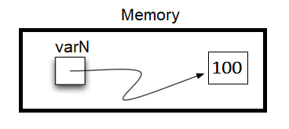
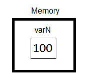
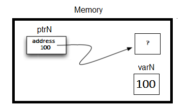

# Atomic C++ Types

## Using Data in C++

primary C++ data types:

- integer (`int`)
- floating point (`float`)
- double precision floating point (`double`)
- Boolean (`bool`)
- character (`char`)
- Special type that holds a memory location (`pointer`)
- These are the **main** data types.

## Numeric Data

This includes `int`, `float`, `float`.

cpp example of different math operations
```cpp
#include <iostream>
#include <cmath>
using namespace std;

int main(){
    cout << (2 + 3 * 4) << endl;
    cout << (2 + 3) * 4 << endl;
    cout << pow(2, 10) << endl;
    cout << float(6) / 3 << endl;
    cout << float(7) / 3 << endl;
    cout << 7 / 3 << endl; //In C++ this is integer division
    cout << 7 % 3 << endl;
    cout << float(3) / 6 << endl;
    cout << 3 / 6 << endl;
    cout << 3 % 6 << endl;
    cout << pow(2, 100) << endl;

    return 0;
}
```

Beware of integer division. In cpp, if you divide two integers, the result will be an integer. 

If you want a floating point result, you need to cast one of the integers to a float.

Python equivalent

```python
def main():

    print(2 + 3 * 4)
    print((2 + 3) * 4)
    print(2 ** 10)
    print(6 / 3)
    print(7 / 3)
    print(7 // 3)
    print(7 % 3)
    print(3 / 6)
    print(3 // 6)
    print(3 % 6)
    print(2 ** 100)

main()
```

## Boolean Data

In cpp, it uses the keyword `bool`. not capitalized. and Booleans are `true` and `false`. Both lowercase. 

`and` = `&&`

`or` = `||`

"not" = `!`

```cpp
#include <iostream>
using namespace std;

int main(){

    int theSum = 4;
    cout << theSum << endl;

    theSum = theSum + 1;
    cout << theSum << endl;

    bool theBool = true;
    cout << theBool << endl;

    theBool = 4;
    cout << theBool << endl;

    return 0;
}
```

What is static typing? 

- It means that the type of a variable is determined at compile time.
- `int theSum = 0;` would initializes it to hold data values is 0. 

C++ often try to do the assignment you requested without complaints, which is what happened in the output. In above exaple, `false == 0` and `true =! false`, so anything that is non-zero and can be converted to a Boolean is not false and thus must be true. 

## Character Data

In Python, strings can be created with single or double quotes. 

In C++, single quotes are for character (`char`) type and double quotes are for `string` data type. Character is a single character (`'a'`)and string is multiple characters (`"hello"`).

## Pointers

A cpp pointer is a variable that stores memory address and can be used to indirectly access data stored at that memory location. 

### **How pointer works in Python?**

In Python, every single thing is stored as an object. So a Python variable is reference to an object stored in memory. Python has two memory locations: one to store the reference and the other to store the variable value itself in an object.  

1. If you do `x = 10`, then an integer object with value 10 is created in memory. 
2. Creating a reference. `x` does not hold 10 but it holds a reference (or pointer) to the location in memory where integer `10` is store. 

A pointer can be thought of as “direction” or address” of where a piece of data is stored in memory. For example, there is many lockers and `10` is stored in one of the locker and `x` holds the key to that specific locker (memory location) 



`varN = 100`. Above is a visual of how pointers work in Python.


### **How does pointers work in C++?**

The value of each variable is stored directly in memory without a reference or object. So access is faster. However this is one of the reasons why we need to declare each variable because amount of memory is different. 

say, `int x = 10` , `x` in this case **is** the locker itself. can becomes a unique identifier for the locker in the storage facility. 

```cpp
int x = 10;      // x is the locker, 10 is the value inside the locker
int* ptr = &x;   // ptr is the key (pointer) that holds the address of x
```

Pointers provide direct access to memory, which allows for dynamic memory management, efficient data manipulation, and the creation of complex data structures



`int varN = 100`. Above is an visual of how pointers work in cpp.

### How to locate the memory address of a variable in C++?

```cpp
#include <iostream>
using namespace std;

// outputs the value of a variable
// as well as the memory address in C++.
int main(){
    int varN = 101;
    cout << varN << endl;
    cout << &varN << endl; //outputs the memory address of variable varN
    return 0;
}
```

In cpp,  `&` is the address operator used to obtain the memory address of a variable. 

Variable are stored in memory location which is dependent upon the run itself and this number can change every time you run it. 

### **Summary**

- In Python, it is impossible to store point directly
    - It is more like references
    - implicit memory management
    - no actual EXPLICIT pointers
    - References are slower but can be useful.
- C++, variable store values directly because they are faster to reference
    - explicit memory management
    - To create an analogous reference to memory location, then we use a special data type called pointer.

### Pointer Syntax

pointer in cpp will “point” to the memory address of some data type. You need an `*` between the data type and the identifier. it is used to declare a pointer. 

```cpp
variableType *identifier; // syntax to declare a pointer
int *ptrx; // example of a pointer to an integer
```

### The address-of operator, `&`

Now we know how to declare pointers, we need to give them the address of where the value is going to be stored. and that is the `&` operator. gives the memory address

Here is a complete example

```cpp
#include <iostream>
using namespace std;

int main() {
    int x = 10;     // Declare an integer variable x
    int* ptr;       // Declare a pointer to an integer

    ptr = &x;       // Assign the address of x to the pointer

    cout << "Value of x: " << x << endl;           // Outputs: 10
    cout << "Address of x: " << &x << endl;        // Outputs: Address of x
    cout << "Value of ptr: " << ptr << endl;       // Outputs: Same address as above
    cout << "Value pointed to by ptr: " << *ptr << endl;  // Outputs: 10

    *ptr = 20;      // Change the value of x using the pointer

    cout << "New value of x: " << x << endl;       // Outputs: 20

    return 0;
}

```

All of these steps are required

1. declaring a pointer `int* ptr;` tell compiler you want to create a pointer variable to hold the memory address of an integer.
2. assigning the address `ptr = &x;` assigns address of specific variable because pointer needs to know which memory lcoation it is pointing to. 
3. Dereferencing `*ptr = 20;` it accesses or modifies the value stored in memory. if you want to use the pointer to interact with the value stored in the variable it is points to. 

**Don’t forget the &**

```cpp
#include <iostream>
using namespace std;

int main( ) {
    int varN = 100;
    int *ptrN = varN; // Note no ampersand,
        // ptrN now refers to memory position 100,
        // whatever happens to be there!
        // You might get an error or you might not!

     cout << "varN value: " << varN << endl;
     cout << "ptrN location: " << ptrN << endl;
     cout << "ptrN points to varN: " << endl;
     cout << "dereference ptrN: " << *ptrN << endl;

     return 0;
}
```



The second `cout` instruction is a disaster because (1) You don’t know what is stored in location 100 in memory, and (2) that location is outside of your segment (area in memory reserved for your program), so the operating system will jump in with a message about a “segmentation fault”. 

### The null pointer

Like `None` in Python, the null pointer (`nullptr`) in C++ points to nothing. 

Null pointer is often used in conditions and/or in logical operations. 

```cpp
#include <iostream>
using namespace std;

//Shows the use of a Null pointer to represent "nothing".
int main( ) {
    int x = 12345;
    int *ptrx = &x;

    while (ptrx) {
        cout << "Pointer ptrx points to " << ptrx << endl;
        ptrx = nullptr;
    }

    cout << "Pointer ptrx points to nothing!\n";
}
```

```
Pointer ptrx points to 0x7ffdb7d9083c
Pointer ptrx points to nothing!
```

## Summary

- All variable must be declared before use in C++
- there are many numeric types
    - `int` for integer
    - `float` and `double` are used for floating point depending on number of digits you want
    - `bool` holds `true` or `false`. LOWERCASE
    - `char` single character in `''`
    - Pointers is variable type to store memory address. To declare a pointer, an `*` is needed

## **Glossary**

**address** - of is used to access the memory address of a C++ variable. 

**atomic data type** - data type that cnanot be broken into simpler data elements

**deference** - reads data in pointers memory location

**pointer** - variable that store and manipulate memory addresses.